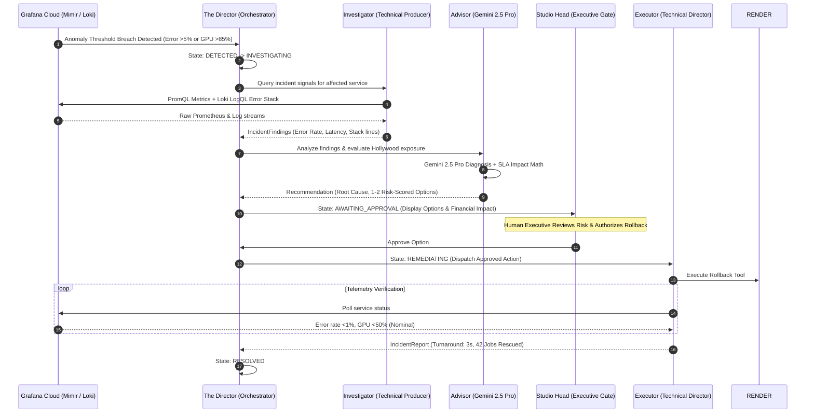

# Studio Sentinel 🎬
### Autonomous AI Production Control Room for Hollywood Media Pipelines
**Google Cloud Agentic Cinema Hackathon — Grafana Labs Track ($15,000 Prize Pool)**

[](https://agentic-cinema.devpost.com/)
[](https://deepmind.google/technologies/gemini/)
[](https://grafana.com/)
[](LICENSE)

---

## Overview

In major film and television productions, unexpected technical failures can stall an entire studio lot. When a 2,000-node VFX render farm runs out of GPU memory, or camera raw footage offloads fail before the morning dailies screening, production grinds to a halt—costing studios **$45,000 to $80,000 per hour** in idle crew and contractual delivery delay penalties.

**Studio Sentinel** is an **Autonomous AI Production Control Room** that guards the 4-stage Hollywood digital media pipeline:
1. 📹 **01 / Ingest**: High-throughput ARRI/RED 8K RAW camera footage offload & checksum validation.
2. 🎞️ **02 / Transcode**: Automated editorial proxy generation and ACES color grading pipeline.
3. ⚡ **03 / Render Farm**: GPU-accelerated VFX & 3D raytracing nodes (CUDA batch workers).
4. 🌐 **04 / Distribution**: Encrypted Master DCI Packages (DCP) and global theatrical CDN streaming.

Powered by **Google Gemini 2.5**, the **Google Agent Development Kit (ADK)**, and **Grafana Cloud (Mimir, Loki, Tempo, and `mcp-grafana`)**, Studio Sentinel continuously monitors telemetry, detects pipeline anomalies, formulates risk-scored remediation strategies, enforces an executive human-in-the-loop governance gate, and autonomously verifies pipeline recovery in seconds.

---

## System Architecture



---

## The Autonomous Multi-Agent Crew

- 🎬 **The Director (Orchestrator):** Manages the deterministic incident state machine (`DETECTED` ➔ `INVESTIGATING` ➔ `AWAITING_APPROVAL` ➔ `REMEDIATING` ➔ `RESOLVED`).
- 🔍 **The Investigator (Technical Producer):** Connects to Grafana Cloud via Model Context Protocol (`mcp-grafana`) and REST APIs, querying PromQL metrics and Loki LogQL error streams without human intervention.
- 🧠 **The Advisor (Systems Director):** Powered by **Gemini 2.5 Pro**, performs deep Hollywood root-cause analysis, predicts queue depth trends, and calculates concrete schedule risk (e.g. frames at risk, dollar exposure, missed dailies cutoff). Formulates 1–2 risk-rated remediation strategies.
- 🛡️ **The Studio Head (Governance & Cloud IAM Gate):** Enforces strict enterprise agent safety. Critical production interventions cannot proceed without human executive sign-off.
- ⚡ **The Executor (Technical Director):** Once authorized, executes the rollback or restart remediation, verifies recovery telemetry in Grafana, and generates an executive post-mortem incident report.

---

## Built-In Hollywood Incident Scenarios

Studio Sentinel includes 3 realistic studio disaster modes to evaluate multi-agent performance:
1. **VFX Render Farm CUDA OOM (`render`)**: Shader release v4.2 causes 98% GPU VRAM exhaustion on 8K composite batches, crashing workers and halting the visual effects pipeline.
2. **Dailies RAW Ingest Checksum Failure (`ingest`)**: High-speed camera card reader corruption triggers MD5 mismatch on ARRI RAW reels, threatening the morning director review.
3. **Master DCP Distribution CDN Timeout (`distribution`)**: Global premiere encrypted DCP delivery stream stalls from edge 504 timeouts, endangering simultaneous worldwide theatrical release.

---

## Quickstart Guide

### Prerequisites
- Docker & Docker Compose (or Python 3.11+ and Node.js 18+)

### 1. Clone & Configure Environment
```bash
git clone https://github.com/Samikshaborude9/Studio-Sentinel.git
cd Studio-Sentinel
cp .env.example .env
```

### 2. Run with Docker Compose
```bash
docker compose up --build
```

- **Frontend Control Room:** [http://localhost:3000](http://localhost:3000)
- **Backend API & Swagger Docs:** [http://localhost:8080/docs](http://localhost:8080/docs)
- **Telemetry Generator:** [http://localhost:9000/metrics](http://localhost:9000/metrics)

---

## Live Grafana Cloud & Gemini Configuration

To connect Studio Sentinel to live Grafana Cloud and Gemini Enterprise:

1. In `.env`, set `DIRECT_MODE=false`.
2. Add your `GOOGLE_API_KEY`.
3. Add your Grafana Cloud credentials:
   ```env
   GRAFANA_URL=https://yourstack.grafana.net
   GRAFANA_SERVICE_ACCOUNT_TOKEN=glsa_...
   LOKI_URL=https://logs-prod-xxx.grafana.net
   LOKI_USER=1770208
   LOKI_API_KEY=glc_...
   ```
4. Start the stack. The generator will push live log streams to Grafana Loki (`/loki/api/v1/push`), and Gemini 2.5 agents will query Grafana Cloud in real time.

---

---

## License

This project is licensed under the MIT License — see the [LICENSE](LICENSE) file for details.
