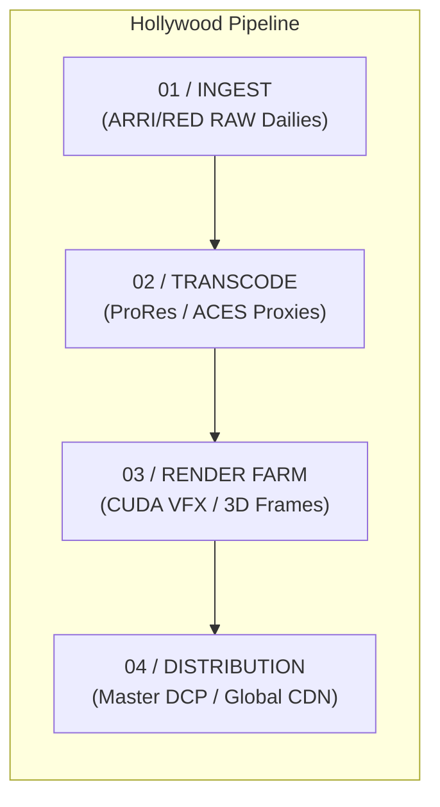
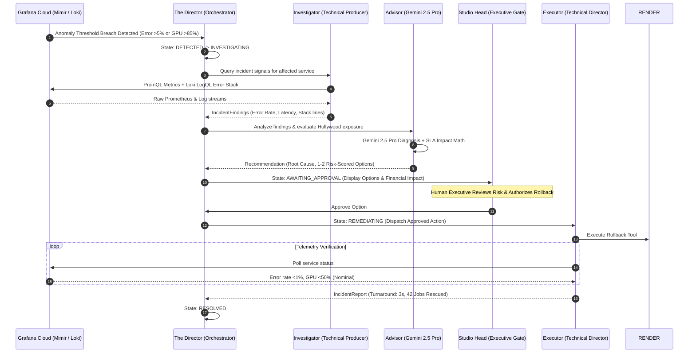

# Studio Sentinel Architecture

Studio Sentinel is an **Autonomous AI Production Control Room** designed for high-throughput Hollywood digital media workflows. It operates across a 4-stage pipeline:

---

## The Autonomous Multi-Agent Hierarchy

---

## Core Components

| Component | Directory | Responsibilities | Technologies |
| :--- | :--- | :--- | :--- |
| **Telemetry Generator** | `packages/generator` | Simulates 4 studio services (`ingest`, `transcode`, `render`, `distribution`). Exposes Prometheus metrics, pushes live log streams to Grafana Loki (`/loki/api/v1/push`), and provides failure injection endpoints. | Python 3.11, FastAPI, Prometheus Client, Loki HTTP API |
| **Agent Orchestrator** | `packages/backend` | Deterministic incident state machine, Gemini 2.5 agent runners, Grafana Cloud / Loki API clients, SQLModel database persistence. | FastAPI, Google GenAI SDK, Google ADK, SQLModel, Supabase Postgres |
| **Control Room UI** | `packages/frontend` | Interactive cinematic interface, pipeline topology flow, Recharts real-time telemetry graphs, agent flight recorder, scenario injector. | Next.js 14, TailwindCSS, Recharts, TypeScript |
| **Grafana MCP Server** | Container `mcp-grafana` | Managed Model Context Protocol adapter for Grafana Cloud. | Grafana Labs MCP Image |
